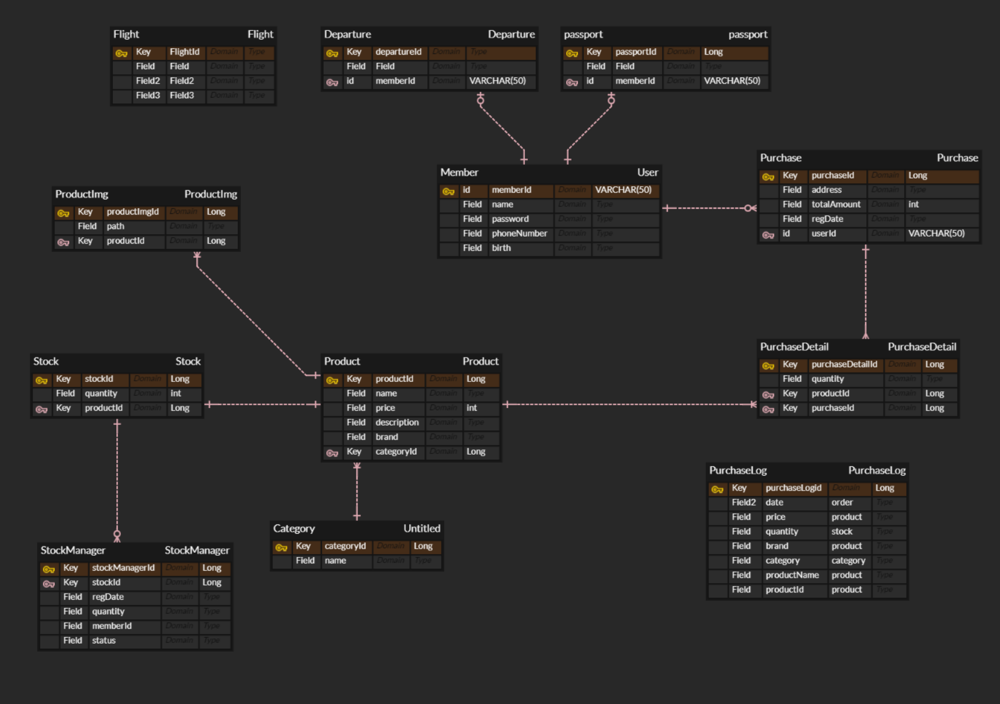
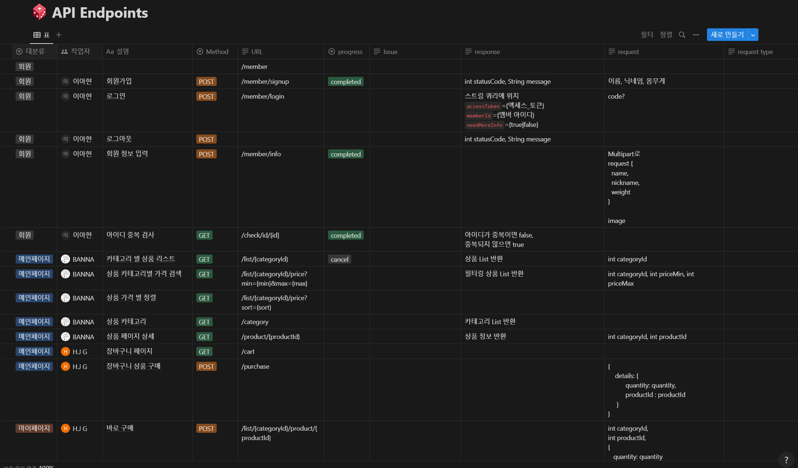

# 아시아나 IDT - DUTY FREE

## 💡 서비스 소개

**집에서도 간편하게, 온라인 면세점**

> 아시아나 IDT에서 진행한 온라인 면세점 프로젝트입니다. 스프링부트와 타임리프를 사용해서 간단한 기능들과, 관리자 기능을 가지고 있습니다.

**DUTY FREE**

## 🛠️ 기술 스택

  
  
  
     
    
   
   

  
  
 

## 🗃️ 프로젝트 구조

### 🏗️ 서비스 구조

## 🔗\***\*Database Modeling\*\***

## 💻 주요 기능 및 데모 영상

## 🗣️ 협업 관리

**Notion**

## 👩‍👩‍👧 개발 멤버 소개

## 📅 프로젝트 기간

### 23.08.22 ~ 23.08.28

- **기획 및 설계** : 23.08.22 ~ 23.08.23
- **프로젝트 구현** : 23.08.23 ~ 23.08.28
- **버그 수정 및 산출물 정리** : 23.08.29 ~ 23.08.30
